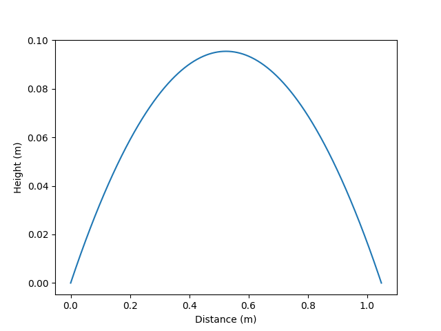

This is a simple project that takes data about an object in projectile motion and graphs the results.

## Example
#### Given
v_i = 4 m/s
Angle = 20 degrees
Gravity = -9.81 m/s^2
Detail = 1000

#### Output
